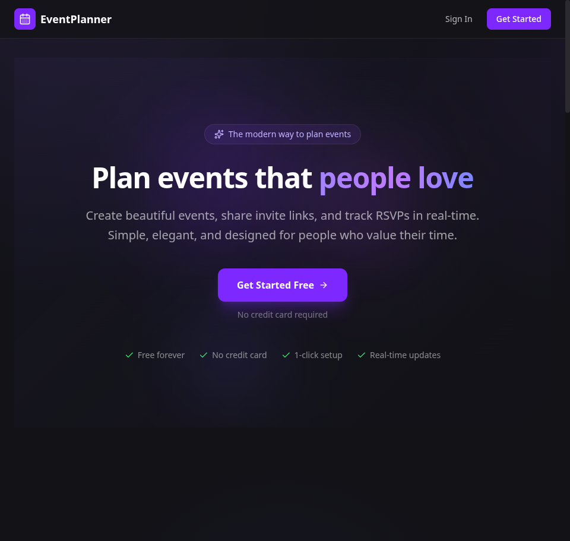
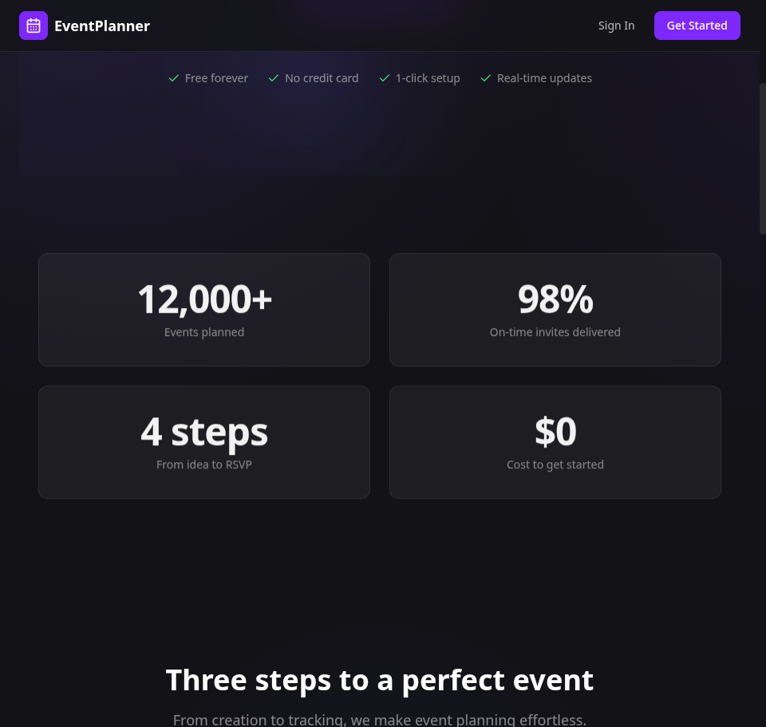
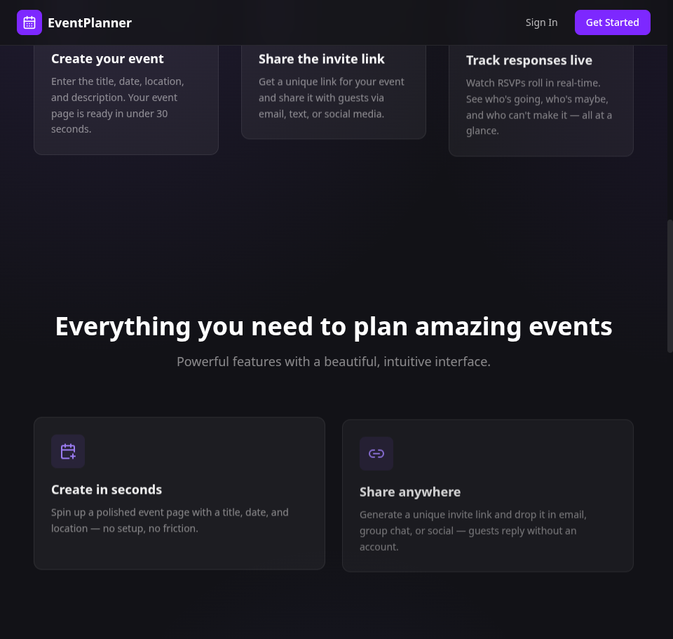
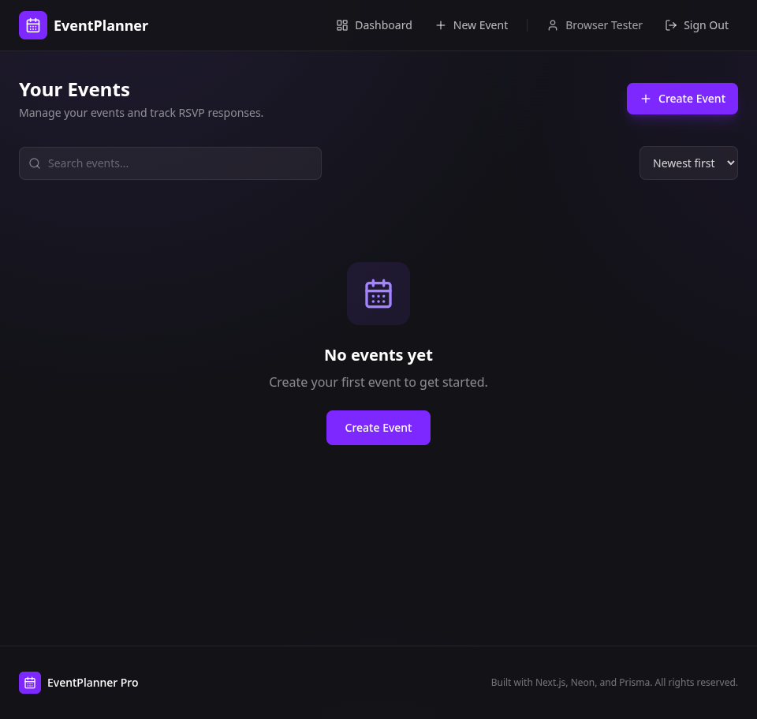
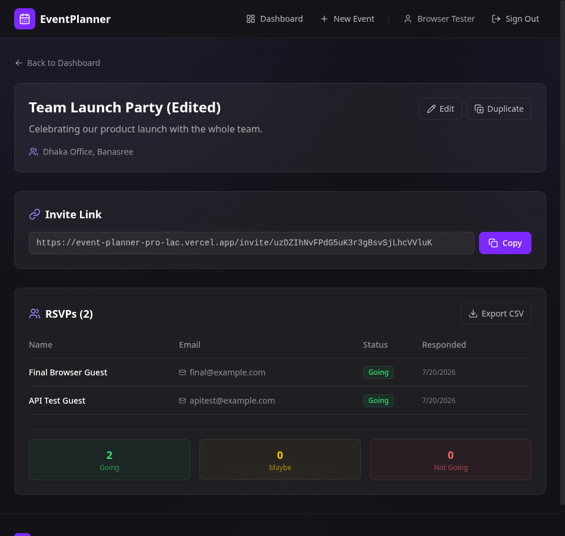
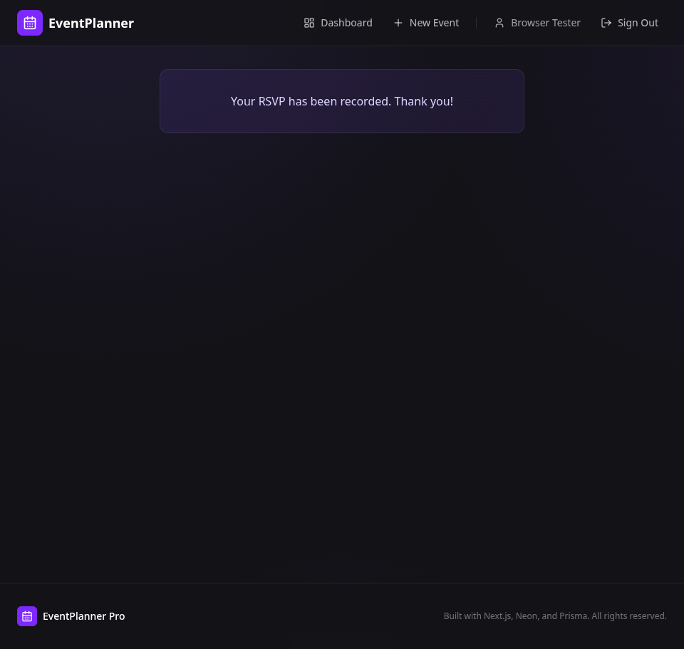

# Event Planner Pro

A full-stack event planning application built with **Next.js 16**, **React 19**, **NextAuth.js**, **Prisma**, and **Neon Postgres**. Create events, share invite links, and track RSVPs with a polished dark-themed UI.

**Live demo:** https://event-planner-pro-lac.vercel.app/

## Features

### Public site
- **Landing page** — Animated hero with floating orbs & gradient shifts, scroll-reveal sections, an animated **stats counter**, a feature bento grid, testimonials, and a **FAQ accordion** (Radix UI).
- **Public RSVP** — Guests respond (Going / Maybe / Not Going) without an account via a unique invite link or the public event page.
- **Toasts** — Instant feedback for every action via Sonner.

### Authenticated app
- **Auth** — Email/password credentials with NextAuth.js (bcrypt-hashed passwords, JWT sessions).
- **Dashboard** — Event cards with RSVP count badges, **search**, **sort** (newest / oldest / title / most RSVPs), copy-invite and create-invite actions, delete events.
- **Create Event** — Title, description, location, date/time.
- **Event Detail** — View info, **edit** event inline, **duplicate** event, generate/copy invite link, manage attendees, **export RSVPs to CSV**, real-time count cards.
- **Attendee Table** — Sortable list with status badges, delete responses.
- **RSVP Summary** — Live count cards for each status.

### Engineering
- **Rate Limiting** — 30 req/min per IP on all API routes.
- **Input Validation** — Structured validation on event creation and RSVP submission.
- **Error Handling** — Error boundaries, loading skeletons, not-found pages, SEO (sitemap + robots.txt).
- **Accessibility** — Reduced-motion support, keyboard-friendly controls.

## Tech Stack

| Layer | Technology |
|---|---|
| Framework | Next.js 16 (App Router) |
| UI | React 19, Tailwind CSS 4 |
| Auth | NextAuth.js (Credentials) |
| Database | Neon Postgres (serverless) |
| ORM | Prisma 7 |
| Icons | Lucide React |
| Toasts | Sonner |
| FAQ | Radix UI Accordion |
| Testing | Vitest + React Testing Library |
| Language | TypeScript 6 |

## Getting Started

### Prerequisites
- Node.js 18+
- A Neon Postgres database
- (Optional) A deployed instance for `NEXT_PUBLIC_APP_URL`

### Setup

```bash
git clone git@github.com:MohammadMuntasirKabir/event-planner-pro.git
cd event-planner-pro
npm install
cp .env.example .env.local
# Fill in DATABASE_URL and NEXTAUTH_SECRET
npx prisma generate
npx prisma db push
npm run dev
```

Open [http://localhost:3000](http://localhost:3000)

### Environment Variables

| Variable | Description |
|---|---|
| `DATABASE_URL` | PostgreSQL connection string (Neon) |
| `NEXTAUTH_SECRET` | Secret for NextAuth session signing (`openssl rand -base64 32`) |
| `NEXTAUTH_URL` | Base URL (http://localhost:3000 in dev) |
| `NEXT_PUBLIC_APP_URL` | Public app URL (used in sitemap/robots) |

### Running Tests

```bash
npm test          # Run all tests
npm run test:watch
```

**206 tests** covering API routes, server actions, components, and UI.

## Database Schema

```
events
  id (UUID, PK), owner_user_id, title, description, location, event_date, created_at, updated_at

event_invites
  id (UUID, PK), event_id (UNIQUE -> events.id, CASCADE), token (UNIQUE), created_at

event_rsvps
  id (UUID, PK), event_id (-> events.id, CASCADE), invite_id (-> event_invites.id)
  name, email, email_normalized, status (going/maybe/not_going)
  responded_at, created_at, updated_at
  UNIQUE(event_id, email_normalized)

users
  id (UUID, PK), email (UNIQUE), name, image, password (bcrypt hash)
```

## API Routes

All mutations use REST API routes consumed by client components via `fetch`
(the UI never relies on Next.js server-action form binding).

| Method | Endpoint | Description |
|---|---|---|
| `POST` | `/api/auth/register` | Email/password signup (JSON or FormData) |
| `GET`/`POST` | `/api/auth/[...nextauth]` | NextAuth credentials provider |
| `POST` | `/api/events` | Create event (rate limited) |
| `PATCH` | `/api/events/[eventId]` | Update event (owner only) |
| `DELETE` | `/api/events/[eventId]` | Delete event (owner only, rate limited) |
| `POST` | `/api/events/[eventId]/invite` | Generate/return invite token (owner only, rate limited) |
| `POST` | `/api/events/[eventId]/duplicate` | Duplicate event (owner only) |
| `GET` | `/api/events/[eventId]/export` | Export RSVPs as CSV (owner only) |
| `POST` | `/api/events/[eventId]/rsvps` | Public RSVP submission (open) |
| `DELETE` | `/api/events/[eventId]/rsvps/[rsvpId]` | Remove RSVP (owner only, rate limited) |

> Server actions in `lib/actions/events.ts` (`createEvent`, `submitRsvp`) remain for
> programmatic/server-side use and are covered by the test suite.

## Project Structure

```
event-planner-pro/
├── app/
│   ├── api/events/[eventId]/     # Event CRUD + invite + duplicate + export API (rate limited)
│   ├── api/events/[eventId]/rsvps/  # Public RSVP submission
│   ├── api/events/[eventId]/rsvps/[rsvpId]/  # Delete RSVP
│   ├── auth/                     # NextAuth sign in / sign up
│   ├── dashboard/                # User's events list (search + sort)
│   ├── events/new/               # Create event form
│   ├── events/[eventId]/         # Event detail (edit, duplicate, export)
│   ├── events/[eventId]/public/  # Public RSVP page (no token)
│   ├── invite/[token]/           # Public RSVP page (by token)
│   ├── error.tsx                 # Error boundary
│   ├── loading.tsx               # Root loading skeleton
│   ├── not-found.tsx             # 404 page
│   ├── robots.ts                 # robots.txt
│   ├── sitemap.ts                # Sitemap
│   ├── layout.tsx                # Root layout (+ <Toaster/>)
│   ├── page.tsx                  # Landing page
│   └── globals.css               # Global styles + animations
├── components/
│   ├── navbar.tsx / footer.tsx
│   ├── hero-section.tsx, stats-section.tsx, how-it-works.tsx
│   ├── features-section.tsx, testimonials-section.tsx, faq-section.tsx
│   ├── dashboard-content.tsx     # Search + sort + copy invite
│   ├── event-detail-content.tsx  # Edit / duplicate / export CSV (fetch-based)
│   ├── rsvp-form.tsx             # Public RSVP form (fetch-based)
│   ├── animated-card.tsx         # Scroll-reveal wrapper
│   └── ui/                        # shadcn-style primitives + sonner
├── lib/
│   ├── actions/events.ts         # Server actions (CRUD + validation + CSV)
│   ├── prisma.ts                 # Prisma client (Neon adapter)
│   ├── rate-limit.ts             # In-memory rate limiter + getClientIp
│   ├── validations.ts            # Input validation helpers
│   └── utils.ts                  # cn, date formatters, token, CSV builder
├── prisma/
│   ├── schema.prisma
│   └── migrations/
└── tests/                         # 206 tests
```

## Screenshots

### Landing page


### Stats + Features


### FAQ accordion


### Dashboard (search & sort)


### Event detail (edit / duplicate / export)


### Public RSVP page


## License

Built with Next.js, NextAuth, Neon, Prisma, Sonner, and Radix UI.
